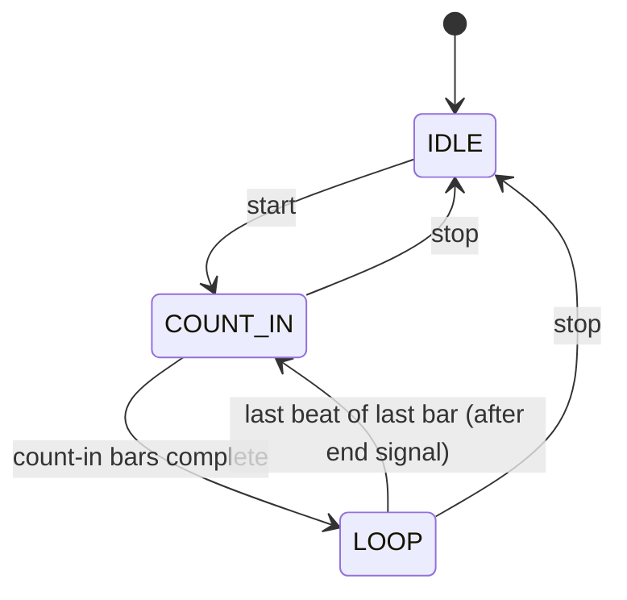

# Metronome Loop Player

> **Status:** planned — not yet implemented

## Overview

Build a named, saveable loop player in the Metronome tab. Each loop defines bar count, time signature, BPM, count-in, and guide notes pinned to specific bar/beat positions. The scheduler extends the existing lookahead pattern with a phase state machine (count-in → loop → end signal → repeat) and fires guide notes through the existing instrument engine for precise Web Audio timing.

---

## Core idea

A `MetronomeLoop` is a named, reusable practice passage with three scheduling phases:



- **COUNT_IN**: plays a distinct lower-pitched click (440 Hz) + visual "IN: 1 2 3 4"
- **LOOP**: standard accent/beat clicks + scheduled guide notes at their bar/beat positions
- **End of loop**: brief descending 3-note chime (1320 → 880 → 660 Hz), then restarts COUNT_IN
- Guide notes play through `getEngine(audioEngineId).playNote(midi, { time: t })` using the shared `AudioContext` from `lib/instrument.ts` — ensures timing alignment with the metronome

---

## Data model

New file [`types/metronome-loop.ts`](../types/metronome-loop.ts):

```typescript
export interface GuideNote {
  bar: number     // 1-indexed
  beat: number    // 1-indexed
  note: string    // e.g. "C4", "G#3"
  enabled: boolean
}

export interface MetronomeLoop {
  id: string
  name: string
  targetBpm: number    // the goal tempo (e.g. 120 BPM at full speed)
  beatsPerBar: number  // 2–7
  noteValue: 4 | 8
  bars: number         // 1–8
  countInBars: number  // 1–2
  guideNotes: GuideNote[]
  createdAt: number
  updatedAt: number
}
```

`targetBpm` is the saved full-speed tempo. The percentage is a **playback-time value** — not persisted — so the loop always reopens at 100% each session.

---

## Storage

New file [`lib/metronome-loop-storage.ts`](../lib/metronome-loop-storage.ts) — same localStorage + Supabase pattern as practice sessions:
- `loadLoops() / saveLoop() / deleteLoop()`
- Falls back to `localStorage` for unauthenticated users

New Supabase migration `supabase/migrations/007_metronome_loops.sql`:
- `metronome_loops` table: `id uuid PK`, `user_id FK`, `name text`, `data jsonb`, `created/updated_at`
- RLS: users can only access their own rows

---

## Scheduling hook

New file [`lib/useLoopScheduler.ts`](../lib/useLoopScheduler.ts):

```typescript
// Extends the same 25ms interval / 100ms lookahead pattern as MetronomePanel
// but tracks phase + absolute beat position and uses the shared AudioContext

type LoopPhase = 'idle' | 'count-in' | 'loop'

interface LoopSchedulerState {
  phase: LoopPhase
  currentBar: number    // 1-indexed, 0 when idle
  currentBeat: number   // 0-indexed within bar
  start: () => void
  stop: () => void
}
```

Key scheduling logic:
- Uses `getAudioContext()` from `lib/instrument.ts` (shared context = guide notes align with metronome)
- At each beat, determines click tone: 440 Hz (count-in) vs 1320/880 Hz (loop accent/beat)
- Looks up `guideNotes` for `(currentBar, currentBeat+1)` → `getEngine(engineId).playNote(midi, { time: t })`
- At last beat of last bar: schedules the 3-note end chime, then resets to count-in phase (or straight back to LOOP if count-in between loops is disabled)

---

## New UI components

```
components/metronome/
├── LoopList.tsx         — sidebar list of saved loops (create, select, delete)
├── LoopEditor.tsx       — name/BPM/time sig/bars form + guide notes grid
├── GuideNotesGrid.tsx   — bar × beat matrix (click cell to add/remove a note)
└── LoopPlayer.tsx       — live phase display + bar/beat indicators + playback controls
```

**GuideNotesGrid** is a table, columns = bars, rows = beats. Each cell either shows an empty slot (click to add) or a note chip with the note name (click to remove or edit). Validation via `Note.midi(name)` from Tonal — invalid names show a red outline.

---

## MetronomeView changes

[`components/metronome/MetronomeView.tsx`](../components/metronome/MetronomeView.tsx) gets a two-mode layout — "Metronome" (existing `MetronomePanel`) and "Loops" (new loop library + player) — using the same pill-style tab switcher used elsewhere in the app.

---

## Target speed controls (simple metronome + loop player)

### Simple metronome — MetronomePanel.tsx changes

A **Simple / Practice** toggle sits at the top of the panel:

- **Simple mode** (default): exactly as today — BPM slider, time signature, accent toggle. No extra controls.
- **Practice mode**: adds a Target BPM field. When set:
  - The slider drives **percentage** (50–100%) rather than raw BPM
  - Actual BPM = `floor(targetBpm × pct / 100)`, shown as a read-only derived value
  - Quick-select buttons: **50% 60% 70% 75% 80% 85% 90% 95% 100%**
  - Fine-tune row: `−` current% display `+` (1% per tap)

Switching modes does not stop the metronome. The selected mode is persisted to `localStorage` so it reopens in the same mode.

### Loop player — percentage controls in LoopPlayer.tsx

Same quick-select + fine-tune row, displayed during playback:
- Changing the percentage mid-loop takes effect on the next bar (the scheduler reads an up-to-date `effectiveBpm` ref, same pattern as `bpmRef` in `MetronomePanel`)
- The current effective BPM and percentage are shown prominently (e.g. "96 BPM — 80%")

---

## Playback toggles (LoopPlayer)

| Toggle | Default | Behaviour |
|---|---|---|
| **Guide notes** | On | When off, scheduler skips guide note playback; loop/count-in/end signal unaffected |
| **Count-in between loops** | On | When off, the first count-in still plays; subsequent repetitions skip straight from end signal back into the loop |

Both toggles are playback-time only — not saved to the loop definition.

---

## Implementation todos

1. `types/metronome-loop.ts` — `MetronomeLoop` + `GuideNote` interfaces
2. `lib/metronome-loop-storage.ts` — CRUD with localStorage + Supabase fallback
3. `supabase/migrations/007_metronome_loops.sql` — table + RLS
4. `MetronomePanel.tsx` — Simple/Practice toggle + target BPM + percentage controls
5. `lib/useLoopScheduler.ts` — phase scheduler hook
6. `components/metronome/GuideNotesGrid.tsx` — bar × beat matrix editor
7. `components/metronome/LoopEditor.tsx` — loop config form
8. `components/metronome/LoopPlayer.tsx` — live player with all playback toggles
9. `components/metronome/LoopList.tsx` — saved loop list
10. `components/metronome/MetronomeView.tsx` — Metronome/Loops tab switcher
